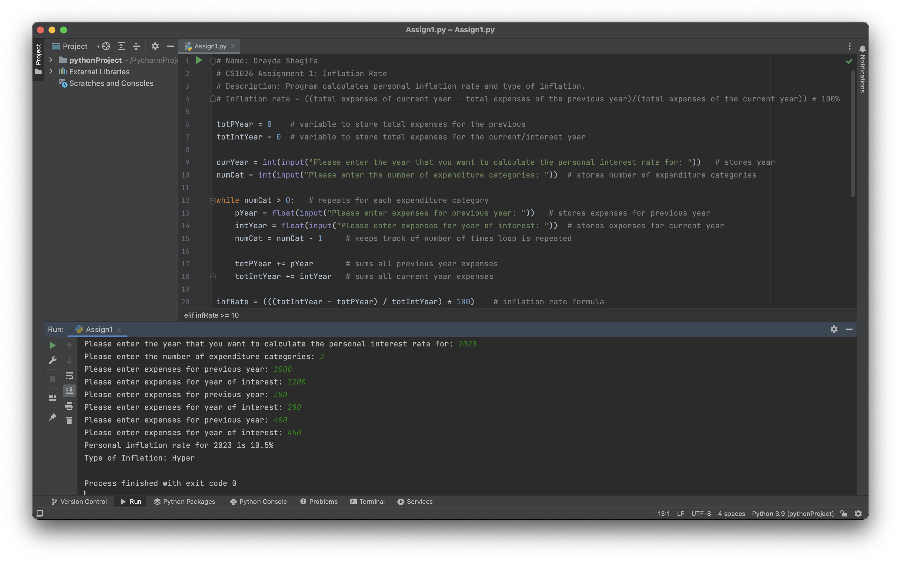

# PersonalInflationRateCalculator
This is a personal inflation rate calculator program. The program calculates the user's personal inflation rate and the type of inflation.

# Demo

# Technical Stack
Python
